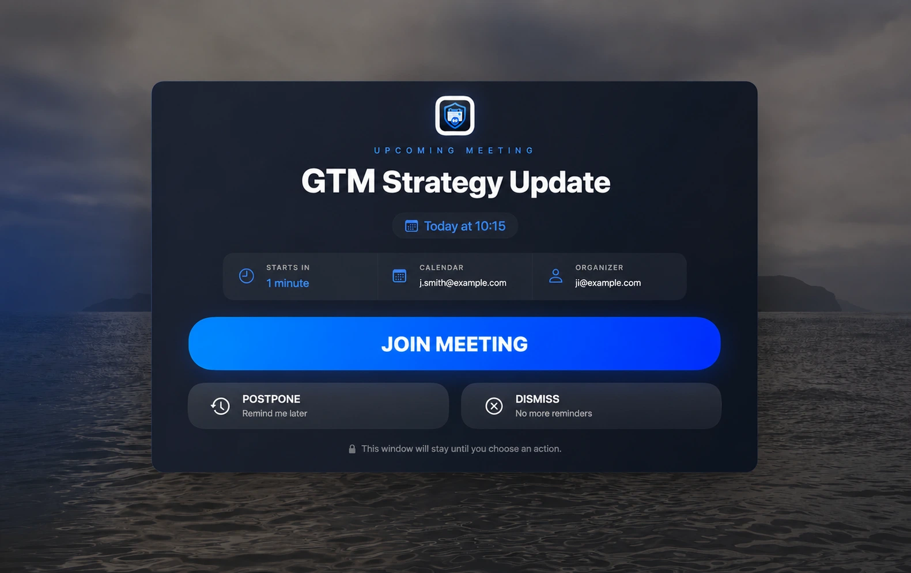

# MeetGuard

MeetGuard is a native macOS menu bar app that reads local Calendar events and shows a fullscreen alert before online meetings. It uses EventKit for local calendar access and iCloud storage for syncing preferences and recent alert dismissals across Macs signed into the same Apple ID.



## Built with Codex

This entire project was created by OpenAI Codex—initially Codex 5.5 and later Codex 5.6—including all code, documentation, designs, and mockups. Not a single line in this project was written by a human. Without Codex, this project would never have been possible.

## Requirements

- macOS 13 or newer
- Xcode 26 or newer, or the matching Apple Swift toolchain
- iCloud enabled on each Mac for cross-device settings and dismissal sync

## Build

```sh
swift build
```

## Test

```sh
swift test
```

## Run as a macOS app

The app needs an app bundle so macOS can apply `LSUIElement` and the Calendar permission usage strings.

```sh
make run
```

This builds `.build/app/MeetGuard.app` and opens it. MeetGuard appears only in the menu bar, requests Calendar access on first launch, and does not show a Dock icon.

## Important: Unsigned App Warning

MeetGuard is not notarized yet because notarization requires a paid Apple Developer account. If macOS says the app is damaged after installing it from the DMG, run:

```sh
xattr -rd com.apple.quarantine /Applications/MeetGuard.app
```

To build the bundle without opening it:

```sh
make app
```

To build a release DMG:

```sh
make dmg
```

The DMG is written to `.build/dist/MeetGuard.dmg`.

## Publish a Release

Authenticate GitHub CLI once:

```sh
gh auth login
```

Then publish a release:

```sh
make release
```

The command asks for the version number, updates the app bundle version, runs tests, builds the release DMG, commits the version bump, creates a `vX.Y.Z` tag, pushes to GitHub, creates a GitHub Release, and uploads the DMG as a release asset.

You can also pass the version non-interactively:

```sh
make release VERSION=1.2.0
```

## Development

Useful commands:

```sh
make build
make test
make app
make dmg
make release
make run
make clean
```

The app scans today's events from all calendars visible to Calendar.app. It inspects event URL, notes, location, and title for conferencing links from Google Meet, Zoom, Microsoft Teams, Webex, plus generic `/join` and `/meeting` URLs.

## Architecture

- `CalendarService`: EventKit permission, event fetching, conversion into meetings.
- `MeetingDetector`: regex-based meeting URL extraction.
- `ReminderScheduler`: lead-time checks, duplicate protection, and postpone state.
- `OverlayManager`: fullscreen overlay windows on all connected displays.
- `SettingsStore`: iCloud KVS-backed preferences and recent dismissed-alert sync.

## Settings

Open the menu bar item and choose `Settings...`.

Default:

- Notify before meeting: 1 minute
- Launch at startup: enabled

The `Preview` button shows the fullscreen overlay using the first conference-link event found today, then the next 10 days. If none is found, MeetGuard uses sample meeting text and opens `https://example.com` when joining.

## Privacy

MeetGuard requests Calendar access and uses `NSUbiquitousKeyValueStore` for preferences and recent alert dismissals. It does not use analytics, telemetry, CloudKit, custom backends, API keys, or third-party frameworks.
